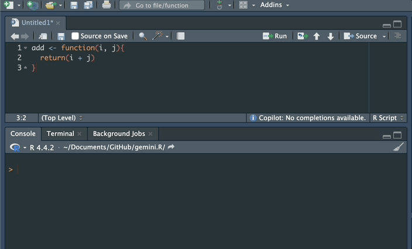

# gemini.R </img>

<!-- badges: start -->

[](https://CRAN.R-project.org/package=gemini.R)
[](https://cran.r-project.org/package=gemini.R)

[](https://jhk0530.r-universe.dev/gemini.R)

<!-- badges: end -->

R package to use Google's gemini via API on R

## Installation

#### From CRAN

```r
install.packages("gemini.R")
```

#### From [R-universe](https://r-universe.dev/search) (development version)

```r
install.packages("gemini.R",
  repos = c("https://jhk0530.r-universe.dev", "https://cloud.r-project.org")
)
```

#### From Github (development version)

```r
# install.packages("pak")
pak::pak("jhk0530/gemini.R")
```

## Usage

### Gemini with AI Studio API

#### Text

```r
library(gemini.R)

setAPI("your API key") # check https://makersuite.google.com/app/apikey
gemini("Explain about the gemini in astrology in one line")

# text
# "Gemini, the third astrological sign, is associated with
# communication, adaptability, and a thirst for knowledge."

```

#### Image

```r
# uses default prompt as "Explain this image"
# uses included image of gemini.R package
gemini_image(image = system.file("docs/reference/figures/image.png", package = "gemini.R"))

# text
# " The image shows a table with a white tablecloth. On the table are two cups of coffee,
# a bowl of blueberries, and five scones. The scones are covered in blueberries and have
# a crumbly texture. There are also some pink flowers on the table. The background is a
# dark blue color. The image is taken from a top-down perspective."

```

#### Audio

```r
# use default prompt as "Describe this audio"
# uses included audio of gemini.R package
gemini_audio(audio = system.file("docs/reference/helloworld.mp3", package = "gemini.R"))

# text
# "The audio contains a clear, crisp recording of a person saying \"Hello world\".
# Following the phrase is a distinct, repeated percussive sound, possibly a rhythmic
# tapping or clicking noise. The sound is consistent and mechanical in nature.\n"

```

#### Image via Shiny

To use `gemini_image` function, image file required.
and I recommend to use shiny app with `fileInput` function.

```r
library(shiny)
library(gemini.R)

setAPI("YOUR KEY")
ui <- fluidPage(
  sidebarLayout(
    NULL,
    mainPanel(
      fileInput(
        inputId = "file",
        label = "Choose file to upload",
      ),
      imageOutput(outputId = "image1"),
      textInput(
        inputId = "prompt",
        label = "Prompt",
        placeholder = "Enter Prompts Here"
      ),
      actionButton("goButton", "Ask to gemini"),
      textOutput("text1")
    )
  )
)

server <- function(input, output) {

  observeEvent(input$file, {
    path <- input$file$datapath
    output$image1 <- renderImage({
      list(
        src = path
      )
    }, deleteFile = FALSE)
  })

  observeEvent(input$goButton, {
    output$text1 <- renderText({
      gemini_image(input$prompt, input$file$datapath)
    })
  })
}

shinyApp(ui = ui, server = server)

```

<p style = 'text-align:center;'>
  
</p>

### Gemini with Vertex AI API

#### Text

```r
tokens <- token.vertex("YOUR_API_KEY.json", model_id = "1.5-flash")
prompt <- "What is sachins Jersy number?"

gemini.vertex(prompt, tokens)
```

<p style = 'text-align:center;'>
  
</p>

#### Image

```r
tokens <- token.vertex("YOUR_API_KEY.json", model_id = "1.5-flash")

gemini_image.vertex(image = "YOUR_IMAGE.png", type, tokens)
```

<p style = 'text-align:center;'>
  
</p>

<p style = 'text-align:center;'>
  
</p>

#### Audio

```r
tokens <- token.vertex("YOUR_API_KEY.json", model_id = "1.5-flash")

gemini_audio.vertex(audio = "YOUR_AUDIO.mp3", tokens)
```

- File upload to Google Cloud using API not supported.
- Instead you must use uploaded file. (e.g. Google Cloud Storage)
- Example sound from [soundbible](https://soundbible.com/2210-SOS-Morse-Code.html)

<p style = 'text-align:center;'>
  
</p>

#### Image generation

```r
gen_image('Draw an image of a cat swimming in the Milky Way')
```

<p style = 'text-align:center;'>
  
</p>

### Rstudio Addins

#### Function documentation (Roxygen)

<p style = 'text-align:center;'>
  
</p>

You may customize keyboard shortcut for this feature.

#### Unit testing (testthat)

<p style = 'text-align:center;'>
  
</p>

## Terms

Before use the API, I recommend that you to check at least the following.

- [Google Cloud Platform Terms of Service](https://cloud.google.com/terms)
- [Gemini API Additional Terms of Service](https://ai.google.dev/gemini-api/terms)

There may be more terms and conditions that you need to check.
Any app which uses the API should be compliant with the Google Terms of Service.

> [!note]
>
> image is from [Google AI for Developers](https://ai.google.dev/tutorials/rest_quickstart)
>
> I've got many inspiration from [Deepanshu Bhalla](https://www.linkedin.com/in/deepanshubhalla/)'s [article](https://www.listendata.com/2023/12/google-gemini-r.html)
